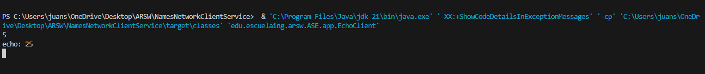

# NamesNetworkClientService

This project is a compilation of programs which do the following:

1. **Exercise 3.1**

      Exercise1: A program in which you create a URL object and print on screen each of the data returned by the 8 methods: getProtocol, getAuthority, getHost, getPort, getPath, getQuery, getFile, getRef.

2. **Exercise 3.2**

      Exercise2: A browser application that asks the user for a URL address, reads data from that address, and stores them in a file named resultado.html.

3. **Exercise 4.3.1**

      EchoServerSquareExercise3: A server that receives a number and responds with the square of this number.

4. **Exercise 4.3.2**

      EchoServerFuncionsExercise4: A server that can receive a number and respond with an operation on this number. This server can receive a message starting with "fun:", and if it receives this message, it changes the operation accordingly. The server must respond with the sine, cosine, and tangent functions. By default, it should start calculating the cosine. For example, if the first number it receives is 0, it should respond with 1. If it then receives π/2, it should respond with 0. If it subsequently receives "fun
      ", it should change the current operation to sine, meaning it should calculate sines from that point onwards. If it then receives 0, it should respond with 0.

5. **Exercise 4.4**

      HttpServerExercise5 : t is a web server that handles a request and returns a web page.

6. **Exercise 4.5.1**

      EchoServerMultiFilesExercise6: A web server that supports multiple consecutive requests (non-concurrent). The server must return all requested files, including HTML pages and images.

7. **Exercise 5.2.1**

      DatagramTimeClientExercise7: A program that connects to a server which responds with the current time. The program should update the time every 5 seconds based on the server's data. If no new time is received, it should maintain the last known time.

8. **Exercise 6.4.1**

      ChatRMI: It's a program that can connect to another application of the same type on a remote server to start a chat. The application requests an IP address and a port before connecting to the desired client.


For example, a typical invocation would be, PowerShell:

```
'route the java.exe del jdk' '-XX:+ShowCodeDetailsInExceptionMessages' '-cp' 'class path in target folder' 'edu.escuelaing.arsw.ASE.app.<NameExercise>'

Examples:

'C:\Program Files\Java\jdk-21\bin\java.exe' '-XX:+ShowCodeDetailsInExceptionMessages' '-cp' 'C:\Users\juans\OneDrive\Desktop\ARSW\NamesNetworkClientService\target\classes' 'edu.escuelaing.arsw.ASE.app.EchoClient'


C:\Program Files\Java\jdk-21\bin\java.exe' '-XX:+ShowCodeDetailsInExceptionMessages' '-cp' 'C:\Users\juans\OneDrive\Desktop\ARSW\NamesNektop\ARSW\NamesNetworkClientService\target\classes' 'edu.escuelaing.arsw.ASE.app.EchoServerFuncionsExercise4'
```

## Starting

In order to use the project on your system, you can access the following link and download a compressed file of it.

You can also clone the file using the following command.

```
git clone https://github.com/Richi025/ARWS-NamesNetworkClientService.git
```
if you want to run the application use the command of PowerShell.

```
'route the java.exe del jdk' '-XX:+ShowCodeDetailsInExceptionMessages' '-cp' 'class path in target folder' 'edu.escuelaing.arsw.ASE.app.EchoClient'

Examples:

'C:\Program Files\Java\jdk-21\bin\java.exe' '-XX:+ShowCodeDetailsInExceptionMessages' '-cp' 'C:\Users\juans\OneDrive\Desktop\ARSW\NamesNetworkClientService\target\classes' 'edu.escuelaing.arsw.ASE.app.EchoClient'


C:\Program Files\Java\jdk-21\bin\java.exe' '-XX:+ShowCodeDetailsInExceptionMessages' '-cp' 'C:\Users\juans\OneDrive\Desktop\ARSW\NamesNektop\ARSW\NamesNetworkClientService\target\classes' 'edu.escuelaing.arsw.ASE.app.EchoServerFuncionsExercise4'
```


## Previous requirements

It is necessary to have "**Maven**" and "**Java**" installed, preferably in their latest versions. Use Visual Studio Code (IDE), if you want run more easy the proyect.

### * Maven
```
Download Maven at http://maven.apache.org/download.html 

Follow the instructions at http://maven.apache.org/download.html#Installation
```
### * Java

```
Download Java at https://www.java.com/es/download/ie_manual.jsp
```


## Acceptance Tests

Once you run each of the programs and use them correctly according to the following instructions, you will get the results shown in the following images.

1. **Exercise 3.1**

You can run the program by executing the file Exercise1.java. 

```
  & 'C:\Program Files\Java\jdk-21\bin\java.exe' '-XX:+ShowCodeDetailsInExceptionMessages' '-cp' 'C:\Users\juans\OneDrive\Desktop\ARSW\NamesNetworkClientService\target\classes' 'edu.escuelaing.arsw.ASE.app.Exercise1'
```


2. **Exercise 3.2**

You can run the program by executing the file Exercise2.java.

```
  & 'C:\Program Files\Java\jdk-21\bin\java.exe' '-XX:+ShowCodeDetailsInExceptionMessages' '-cp' 'C:\Users\juans\OneDrive\Desktop\ARSW\NamesNetworkClientService\target\classes' 'edu.escuelaing.arsw.ASE.app.Exercise2'
```


3. **Exercise 4.3.1**

You can run the program by first executing the server (EchoServerSquareExercise3) and then the client (EchoClient.java). Now you can enter a number from the client console and the server will respond with its square.

```
 & 'C:\Program Files\Java\jdk-21\bin\java.exe' '-XX:+ShowCodeDetailsInExceptionMessages' '-cp' 'C:\Users\juans\OneDrive\Desktop\ARSW\NamesNetworkClientService\target\classes' 'edu.escuelaing.arsw.ASE.app.EchoServerSquareExercise3'
```
```
  & 'C:\Program Files\Java\jdk-21\bin\java.exe' '-XX:+ShowCodeDetailsInExceptionMessages' '-cp' 'C:\Users\juans\OneDrive\Desktop\ARSW\NamesNetworkClientService\target\classes' 'edu.escuelaing.arsw.ASE.app.EchoClient'
5
echo: 25
```



4. **Exercise 4.3.2**

You can run the program by first executing the server (EchoServerFuncionsExercise4) and then the client (EchoClient.java). Now you can enter a number from the client console and the server will respond with the result of the "cos" function. If you type fun
or fun
, it will switch to these functions and return a response accordingly.

```
  c:; cd 'c:\Users\juans\OneDrive\Desktop\ARSW\NamesNetworkClientService'; & 'C:\Program Files\Java\jdk-21\bin\java.exe' '-XX:+ShowCodeDetailsInExceptionMessages' '-cp' 'C:\Users\juans\OneDrive\Desktop\ARSW\NamesNetworkClientService\target\classes' 'edu.escuelaing.arsw.ASE.app.EchoClient'
5
echo: Result: 0.28366218546322625
fun: sin
echo: Operation changed to: sin
1
echo: Result: 0.8414709848078965
```


5. **Exercise 4.4**

You can run the program by executing the file HttpServerExercise5.java, then you can open a browser and use the link: "http://localhost:35000/"

```
  & 'C:\Program Files\Java\jdk-21\bin\java.exe' '-XX:+ShowCodeDetailsInExceptionMessages' '-cp' 'C:\Users\juans\OneDrive\Desktop\ARSW\NamesNetworkClientService\target\classes' 'edu.escuelaing.arsw.ASE.app.HttpServerExercise5'
Listo para recibir ...
```


6. **Exercise 4.5.1**

You can run the program by executing the file EchoServerMultiFilesExercise6.java, then you can open a browser and use the link: or  or "http://localhost:8080/resultado.html"

```
 & 'C:\Program Files\Java\jdk-21\bin\java.exe' '-XX:+ShowCodeDetailsInExceptionMessages' '-cp' 'C:\Users\juans\OneDrive\Desktop\ARSW\NamesNetworkClientService\target\classes' 'edu.escuelaing.arsw.ASE.app.EchoServerMultiFilesExercise6'
Web server started on port 8080
```

 "http://localhost:8080/ejemplo.html" 


"http://localhost:8080/google.jpg" 


http://localhost:8080/resultado.html 


7. **Exercise 5.2.1**

You can run the program by first executing the server (DatagramTimeServerExercise7) and then the client (DatagramTimeClientExercise7.java). Now, in the client console, you will receive the server's response time every 5 seconds. If you restart the server, the console will show the updated time.

```
 & 'C:\Program Files\Java\jdk-21\bin\java.exe' '-XX:+ShowCodeDetailsInExceptionMessages' '-cp' 'C:\Users\juans\OneDrive\Desktop\ARSW\NamesNetworkClientService\target\classes' 'edu.escuelaing.arsw.ASE.app.DatagramTimeServerExercise7'
```

```
 & 'C:\Program Files\Java\jdk-21\bin\java.exe' '-XX:+ShowCodeDetailsInExceptionMessages' '-cp' 'C:\Users\juans\OneDrive\Desktop\ARSW\NamesNetworkClientService\target\classes' 'edu.escuelaing.arsw.ASE.app.DatagramTimeClientExercise7'
Date: Thu Jun 20 19:03:54 COT 2024
No response received, maintaining last received time.
Date: Thu Jun 20 19:03:54 COT 2024
No response received, maintaining last received time.
Date: Thu Jun 20 19:03:54 COT 2024
Date: Thu Jun 20 19:04:19 COT 2024

```


8. **Exercise 6.4.1**

Pending

## Built with

* [Maven](https://maven.apache.org/) - Dependency management
* [java](https://www.java.com/es/) - Programming language

## Versioned

We use [Git](https://github.com/) for version control. For available versions, see the tags in this repository.

## Authors

* **Jose Ricardo Vasquez Vega** - [Richi025](https://github.com/Richi025)

## Date

Wednesday, June 21, 2024

## License

This project is licensed under the GNU license; See the [LICENSE.txt](LICENSE.txt) file for details.